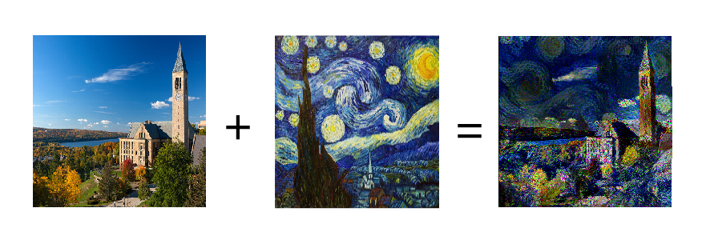

# Neural-Style-Transfer
An implementation of fast (& slow) neural style transfer

This work is explained in the jupyter notebook titled `NST_Pytorch.ipnyb`. I recommend reading it for the best understanding of this project.

## What is neural style transfer?
Neural style transfer(NST) is the process of teaching the computer to take a content image(in the above example it's the picture of Cornell) and a style image(e.g. Starry Night) and generate an image with the content of the former in the style of the latter. Research about this began after the seminal paper [A Neural Algorithm of Artistic Style](https://arxiv.org/abs/1508.06576) by Gatys, Ecker, and Bethge. Since then, there have been many more papers, including the one I'm implementing(and improving upon based on research since): [Perceptual Losses for Real-Time Style Transfer and Super Resolution](https://arxiv.org/abs/1603.08155) by Justin Johnson, Alexandre Alahi, and Li Fei-Fei.

## What is fast neural style transfer?
The original way neural style transfer worked was by taking random noise and optimizing it according to a special loss function to produce the stylized image desired. While the quality of these images is fantastic, generating them takes far too long. Fast neural style transfer is training a neural network to learn to do the stylization. Then, at run time, it's super quick to generate the images. This has led to some neat things like being able to stylize videos which previously was just too expensive. Fast NST typically is one style per model, so for example, if you want to be able to quickly generate images in the style of The Scream and Starry Night, you would need to train new models. There is research on making models that can be used for any style as well as any content image, but they're a bit too expensive for a college student to be able to train.

## Why implement this?
I thought it sounded cool and wanted to learn about / put into practice computer vision.

## Why is there a notebook and a bunch of python files?
I used the notebook to first write all the code and experiment(as well as train the model in the notebook using Google Colab). It explains the project step by step. The python files are for reproducibility. Since a Jupyter notebook can run things multiple times and out of order, it's not a very reliable way of generating a model. The python files aim to simplify things and make the process more reproducable.

## What styles can I apply to my images?
I've trained two models, one on The Scream and one on Starry Night. They're saved in the files `scream.pth.tar` & `starry_night.pth.tar` and an explanation of how they can be accessed is in `predict.py`(also shown at the bottom of the notebook). You can also *slowly* generate images in any style using `slowNST.py`.

## Other notes
The mscoco dataset was used to train this model. It is not included in the github. If you wish to use this code to train a model for yourself, you'll need to download the [2014 training images](http://cocodataset.org/#download). It's a big file!
